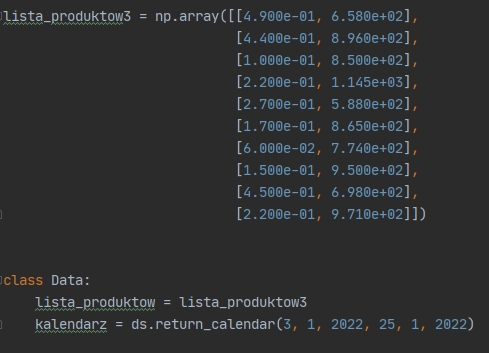
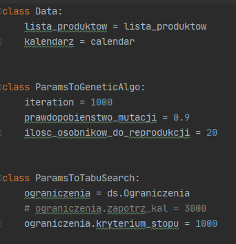
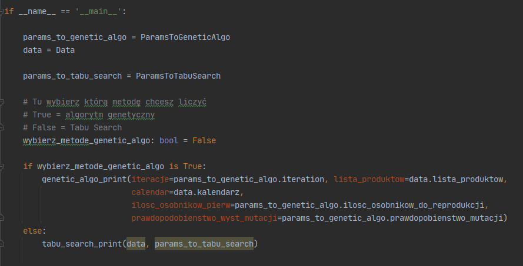

# bo2_project
## Opis
Celem projektu jest zapoznanie się z wybranymi algorytmami. Należało wybrać problem do optymalizacji, a następnie wdrożyć 2 algorytmy:
 - Tabu Search
 - Algorytm genetyczny
aby końcowo otrzymać rozwiązanie optymalne według wybranych kryteriów i założeń.

## Wymagania
 - Python 3.7 lub nowszy
 - numpy
 - pandas
 - random
 - datetime

## Zmiana danych wejsciowych

Dane wejściowe wpisujemy w strukturze Data:
 - do parametru lista produktów przesyłamy listę w postacji np.ndarray
 - kalendarz ustawiamy w postaci pierwszy dzień: DD/MM/RRRR, ostatni dzień: DD/MM/RRRR  

## Parametry

Parametry ustalamy w klasach **ParamsToGeneticAlgo** dla algorytmu genetycznego:
 - iteration - ilość iteracji, kryterium stopu
 - prawdopodobieństwo mutacji, wartości [0, 1]
 - ilość osobników do reprodukcji
 
 oraz **ParamsToTabuSearch** dla algorytmu Tabu Search:
 - ilość iteracji, kryterium stopu
 
 
  
 ## Uruchamianie aplikacji
 Aby uruchomic aplikacje trzeba wczytać katalog **project** do IDE
 następnie w pliku main.py na końcu pliku jest funkcja wywołująca main
 Ustawiając flagę **wybierz_metode_genetic_algo** na:
 - True = wybieramy algorytm genetyczny
 - False = wybieramy Tabu Search

## Instalacja potrzebnych bibliotek

`pip install -r requirements.txt`
